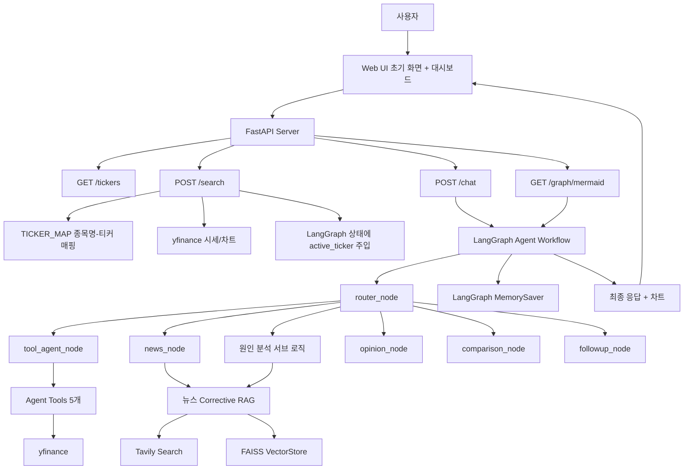
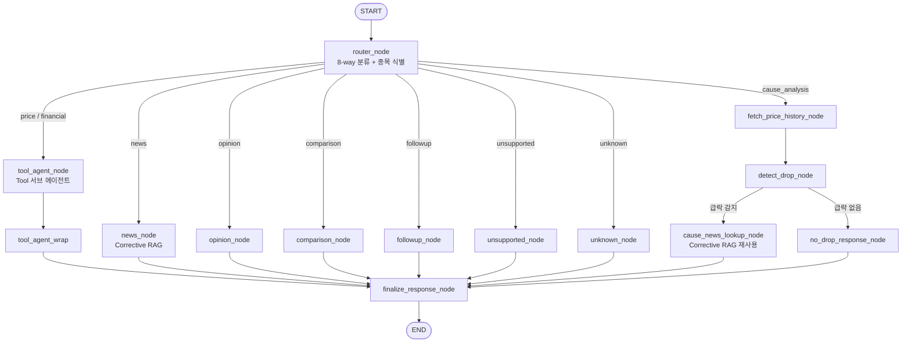
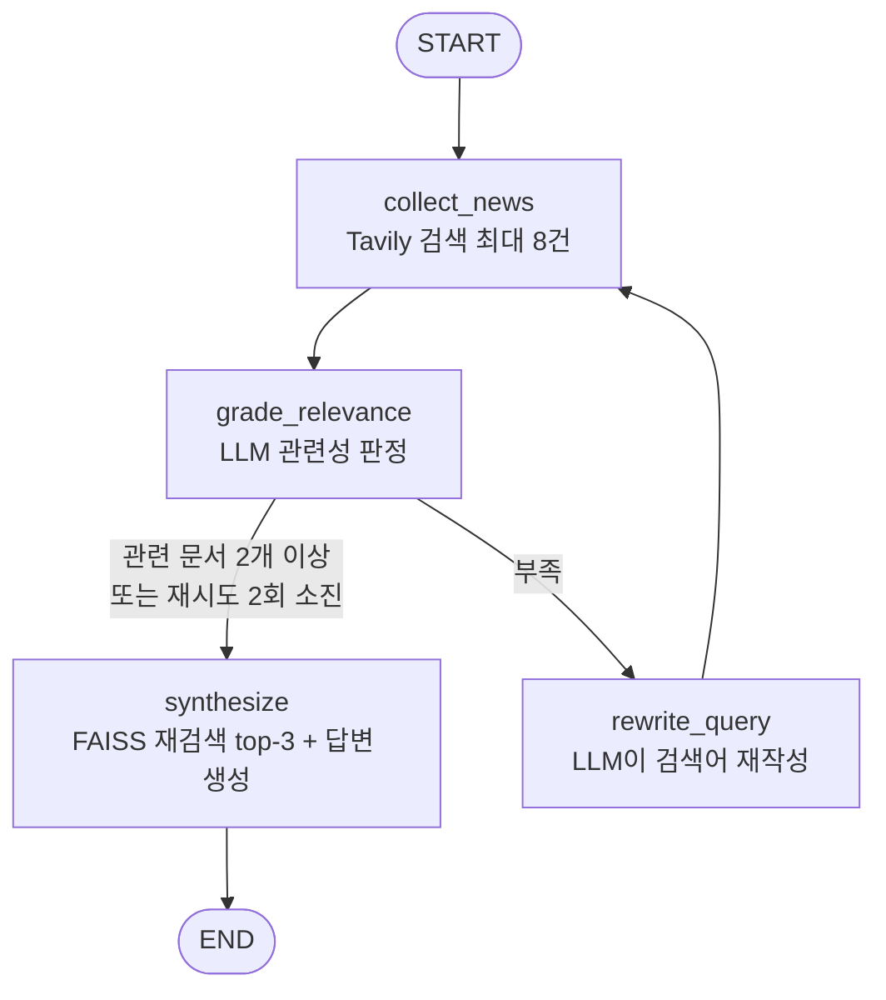

# StockMate Agent

## 목차

1. [서비스 소개](#1-서비스-소개)
2. [주요 기능](#2-주요-기능)
3. [프로젝트 구조](#3-프로젝트-구조)
4. [전체 아키텍처](#4-전체-아키텍처)
5. [Workflow 다이어그램](#5-workflow-다이어그램)
6. [RAG 처리 흐름](#6-rag-처리-흐름)
7. [Tools](#7-tools)
8. [Memory](#8-memory)
9. [Middleware](#9-middleware)
10. [APIs](#10-apis)
11. [설치 및 실행 방법](#11-설치-및-실행-방법)
12. [사용 시나리오](#12-사용-시나리오)
13. [한계점](#13-한계점)
14. [향후 개선 방향](#14-향후-개선-방향)
15. [데이터 출처](#15-데이터-출처)

---

## 1. 서비스 소개

StockMate Agent는 코스피(KOSPI) 상장 종목을 대상으로 하는 개인 투자 리서치 보조 Agent입니다.

종목 하나를 살펴볼 때도 현재가는 증권 앱에서, 뉴스는 포털에서, 재무제표·목표주가·배당은 또 다른 사이트에서 각각 찾아봐야 하는 불편함이 있습니다. 게다가 "이 종목 왜 갑자기 떨어졌지?", "저 종목이랑 비교하면 어때?" 같은 질문에 답하려면 여러 화면을 오가며 스스로 짜맞춰야 합니다.

이러한 문제를 해결하기 위해 시세 조회, 재무제표·목표주가·배당·이동평균선 조회, 뉴스 검색, 급락·급등 원인 분석, 두 종목 비교, 투자 참고 의견까지 하나의 대화형 세션 안에서 이어서 사용할 수 있는 StockMate Agent를 제작하였습니다.

사용자는 종목명을 검색한 뒤 자연어로 질문할 수 있으며, Agent는 yfinance·Tavily 등 외부 데이터를 조회해 답변합니다. 단, "매수/매도를 대신 결정해주는 도구"가 아니라 **판단에 참고할 정보를 정리해주는 도구**로 범위를 한정했습니다 — 투자 의견·비교 응답에는 항상 면책 문구가 붙고, 결론을 내리지 않도록 프롬프트에서 명시적으로 금지합니다.

**주의: 주식 검색 시, 혹은 초기 화면에서 주식 선택시 지연이 존재하니 잠시 기다리시거나 새로고침을 진행하시기 바랍니다.**

---

## 2. 주요 기능

| 기능                   | 설명                                                       |
| ---------------------- | ---------------------------------------------------------- |
| 종목 검색              | 종목명을 검색하면 시세 카드와 주간 차트를 세션 단위로 표시 |
| 실시간 시세 조회       | 현재가, 등락률, 당일 고가/저가, 52주 최고가 조회           |
| 재무제표 조회          | 매출/영업이익/순이익 등 핵심 재무 지표 조회                |
| 목표주가·투자의견 조회 | 애널리스트 목표주가 컨센서스와 투자의견 조회               |
| 배당 정보 조회         | 최근 배당 이력과 최근 1년 배당수익률(추정) 조회            |
| 이동평균선 신호 조회   | 5일/20일 이동평균선 배열, 골든/데드크로스 여부 조회        |
| 뉴스 검색              | 최신 이슈·뉴스를 Corrective RAG로 검색해 답변              |
| 급락·급등 원인 분석    | 최근 90일 가격 급락을 탐지한 뒤 관련 뉴스로 원인 설명      |
| 투자 참고 의견         | 매수/매도 추천 없이 긍정·리스크 요인만 균형 있게 정리      |
| 두 종목 비교           | 두 종목의 시세와 요인을 나란히 비교(결론 없음)             |
| 답변 부연설명          | 새로 조회하지 않고 직전 답변을 더 자세히/쉽게 다시 설명    |
| 지원 범위 밖 질문 안내 | 코스피 종목과 무관한 질문은 Tool/RAG 호출 없이 안내만 반환 |

---

## 3. 프로젝트 구조

```text
summer_final/
├── App.py
├── stockmate/
│   ├── __init__.py
│   ├── tickers.py
│   ├── tools.py
│   ├── schemas.py
│   ├── news_rag.py
│   ├── router.py
│   └── graph.py
├── requirements.txt
├── .env.example
├── .gitignore
├── kospi_tickers_cache.json
├── README.md
└── static/
    ├── index.html
    ├── Script.js
    └── Style.css
```

### 파일별 역할

| 파일/폴더                  | 설명                                                                                                |
| -------------------------- | --------------------------------------------------------------------------------------------------- |
| `App.py`                   | FastAPI 앱 진입점. 정적 파일 서빙 + `/tickers`·`/search`·`/chat`·`/graph/mermaid` 엔드포인트만 담당 |
| `stockmate/__init__.py`    | 패키지 초기화, `.env` 로드(다른 서브모듈보다 먼저 실행되어야 함)                                    |
| `stockmate/tickers.py`     | 종목명 ↔ 티커 매핑 (KIND 조회 + 캐시 + 폴백 목록)                                                   |
| `stockmate/tools.py`       | yfinance 기반 Tool 5개 + 대시보드/그래프 노드용 헬퍼 함수                                           |
| `stockmate/schemas.py`     | 구조화된 출력 Pydantic 모델 + LangGraph State 타입                                                  |
| `stockmate/news_rag.py`    | 뉴스 Corrective RAG 서브그래프                                                                      |
| `stockmate/router.py`      | 라우터 프롬프트 + 8-way 분류 로직                                                                   |
| `stockmate/graph.py`       | Tool 서브 에이전트 + 모든 노드 함수 + 메인 StateGraph 조립                                          |
| `static/`                  | Web UI (hero 검색 화면 + 시세 대시보드 + 채팅 카드)                                                 |
| `kospi_tickers_cache.json` | KIND 종목명-티커 매핑 캐시(최초 실행 시 자동 생성)                                                  |
| `requirements.txt`         | 실행에 필요한 패키지 목록(버전 고정)                                                                |
| `.env.example`             | 환경변수 예시 파일                                                                                  |

---

## 4. 전체 아키텍처

StockMate Agent는 FastAPI 서버, LangGraph 기반 Agent Workflow, 뉴스 RAG 검색, Tool 서브 에이전트, Web UI로 구성됩니다.



---

## 5. Workflow 다이어그램

아래 다이어그램은 LangGraph 기반 Agent의 전체 실행 흐름을 나타냅니다. 사용자 요청은 `router_node`에서 먼저 8-way로 분류되고, 요청 유형에 따라 시세/재무(Tool 서브 에이전트), 뉴스, 원인 분석, 투자 의견, 비교, 부연설명 등의 노드로 분기됩니다.



```text
http://127.0.0.1:8000/graph/mermaid
```

### 라우팅 표

| route                 | 이동 노드                                    | 설명                                                   |
| --------------------- | -------------------------------------------- | ------------------------------------------------------ |
| `price` / `financial` | `tool_agent_node`                            | Tool 서브 에이전트가 5개 Tool 중 자율 선택             |
| `news`                | `news_node`                                  | Corrective RAG                                         |
| `cause_analysis`      | `fetch_price_history` → `detect_drop` → 분기 | 급락 탐지 + RAG 재사용                                 |
| `opinion`             | `opinion_node`                               | 기존 시세/급락 이력 재사용, 매수 추천 없이 요인만 정리 |
| `comparison`          | `comparison_node`                            | 두 종목 비교, 어느 쪽 사라는 결론 금지                 |
| `followup`            | `followup_node`                              | 새 조회 없이 직전 답변을 다시 풀어 설명                |
| `unsupported`         | `unsupported_node`                           | 코스피 미등록 종목 안내                                |
| `unknown`             | `unknown_node`                               | 지원 범위 밖 질문 안내                                 |

---

## 6. RAG 처리 흐름

뉴스 검색과 급락·급등 원인 분석은 Corrective RAG 서브그래프를 통해 처리됩니다(`news`/`cause_analysis` 양쪽에서 재사용).



### RAG 동작 과정

1. 사용자가 뉴스 또는 급락 원인 관련 질문을 한다.
2. Tavily Search로 관련 뉴스를 최대 8건 검색한다(원인 분석의 경우 급락일 전후 날짜 범위를 검색어에 포함).
3. LLM이 검색된 문서마다 질문과 실제로 관련 있는지 판정한다.
4. 관련 문서가 2개 미만이고 재시도 2회 미만이면, LLM이 검색어를 재작성해 다시 검색한다.
5. 관련 문서가 충분하거나 재시도 한도에 도달하면 다음 단계로 넘어간다.
6. 관련 문서만 OpenAIEmbeddings로 임베딩해 FAISS 벡터스토어를 만든다.
7. 원 질문과 가장 유사한 top-3 문서만 추려낸다.
8. 그 3개를 근거로 LLM이 최종 답변을 생성한다.

관련 문서를 끝내 찾지 못하면 "관련 뉴스를 찾지 못했습니다."를 반환합니다(별도의 키워드 fallback 없음).

---

## 7. Tools

`tool_agent`(gpt-4o-mini + `create_agent`)가 사용자 질문에 따라 아래 5개 Tool 중 자율적으로 골라 호출합니다. 전부 입력은 `ticker: str`(yfinance 형식, 예: `005930.KS`) 하나이고, 반환은 LLM이 그대로 읽어서 답변에 녹여낼 자연어 문자열입니다.

| Tool                              | 역할                                           | 반환 예시                                                                          |
| --------------------------------- | ---------------------------------------------- | ---------------------------------------------------------------------------------- |
| `get_stock_price(ticker)`         | 실시간(준실시간) 주가 조회                     | `"현재가: 285,750원, 전일종가: 280,250원, 거래량: 12,345,678"`                     |
| `get_financial_statement(ticker)` | 최근 재무제표 핵심 지표 조회                   | `"2025년 12월 결산 기준\nTotal Revenue: 300,000,000,000\n..."`                     |
| `get_analyst_opinion(ticker)`     | 애널리스트 목표주가/투자의견 조회              | `"평균 목표주가: 76,000원\n투자의견: buy\n..."` (데이터 없으면 폴백 문구)          |
| `get_dividend_info(ticker)`       | 최근 배당 이력 + 1년 배당수익률 조회           | `"최근 배당: 2025-12-15, 주당 361원\n최근 1년 배당수익률(추정): 1.85% ..."`        |
| `get_technical_signal(ticker)`    | 5일/20일 이동평균선 배열, 골든/데드크로스 조회 | `"현재 이동평균선 배열: 5일선이 20일선 위 (...)\n2026-06-20 골든크로스 발생(...)"` |

대시보드 카드/차트/급락 탐지용 함수(`get_stock_stats`, `get_price_history`, `get_weekly_chart_data`)는 Tool이 아니라 노드/엔드포인트가 결정론적으로 직접 호출합니다(LLM이 자율적으로 고르는 대상이 아님).

---

## 8. Memory

멀티턴 대화 흐름을 유지하기 위해 아래와 같은 메모리를 사용합니다.

| Memory                                 | 설명                                                                                                                                                           |
| -------------------------------------- | -------------------------------------------------------------------------------------------------------------------------------------------------------------- |
| `MemorySaver` (LangGraph checkpointer) | `thread_id` 기준으로 대화 메시지 이력과 활성 종목 상태(`active_ticker`, `active_company_name`, `compare_ticker`, `compare_company_name` 등)를 세션 단위로 유지 |
| `kospi_tickers_cache.json`             | KIND에서 조회한 종목명-티커 매핑을 로컬에 캐시(최초 1회 조회 후 재사용)                                                                                        |
| 프론트엔드 `thread_id`                 | 종목을 새로 검색할 때마다 재발급되어, 종목 전환 시 이전 대화 맥락이 새 종목 질문에 섞이지 않도록 분리                                                          |

이를 통해 사용자는 종목명을 매번 다시 말하지 않아도 같은 세션에서 시세/뉴스/재무/비교 질문을 자연스럽게 이어갈 수 있습니다.

---

## 9. Middleware

### Tool 레벨

- `ToolRetryMiddleware`: 연결 오류(`ConnectionError`, `TimeoutError`) 발생 시 최대 3회 지수 백오프 재시도
- `ToolCallLimitMiddleware(run_limit=5)`: 한 턴에 Tool 호출 5회로 제한

### API 엔드포인트 레벨 예외 처리

Tool 호출 실패는 위 미들웨어가 재시도로 흡수하지만, 그 바깥의 FastAPI 엔드포인트에서도 예상 못 한 실패(외부 API 타임아웃, yfinance 응답 이상 등)가 그대로 500 에러로 노출되지 않도록 처리했습니다.

- `POST /search`: `get_stock_stats`/`get_weekly_chart_data` 호출을 try/except로 감싸서, yfinance 쪽 문제가 생기면 `502` + "시세 정보를 가져오지 못했습니다. 잠시 후 다시 시도해 주세요."를 반환합니다.
- `POST /chat`: `graph.invoke(...)` 전체를 try/except로 감쌌습니다. 이 한 지점이 라우터/Tool/RAG/LLM 호출 등 그래프 내부의 **어떤 노드에서 실패하든** 공통으로 잡아내는 방어선 역할을 합니다. 실패 시 `503` + "요청을 처리하지 못했습니다. 잠시 후 다시 시도해 주세요."를 반환합니다. 차트 재조회는 응답의 부가 정보라 실패해도 전체 응답을 막지 않도록 별도로 얕게 try/except 처리되어 있습니다(실패 시 `chart: null`).
- 프론트엔드(`Script.js`)의 `performSearch`/`sendChat`도 응답 실패 시 `detail` 필드를 우선으로 읽어 위 메시지를 그대로 화면에 표시합니다.

### 구조화된 출력

`RouteDecision`, `RelevanceCheck`, `InvestmentOpinion`, `ComparisonFactors` 4개 지점에서 Pydantic 모델 + `llm.with_structured_output(...)`을 사용합니다.

---

## 10. APIs

| Method | URL              | 설명                                                          |
| ------ | ---------------- | ------------------------------------------------------------- |
| GET    | `/`              | 정적 프론트엔드(`static/index.html`) 반환                     |
| GET    | `/tickers`       | 자동완성 드롭다운용 코스피 종목 목록(name/code)               |
| GET    | `/graph/mermaid` | LangGraph 메인 StateGraph를 Mermaid 텍스트로 반환             |
| POST   | `/search`        | 종목 검색, 시세+차트 반환, 그래프 상태에 `active_ticker` 주입 |
| POST   | `/chat`          | 메시지 처리, 최종 응답 + 차트 반환                            |

FastAPI 앱이라 서버 실행 후 `http://127.0.0.1:8000/docs`(Swagger UI) / `/redoc`에서도 아래 스키마가 자동 문서화되어 인터랙티브하게 확인할 수 있습니다.

### `GET /tickers` 응답 예시

```json
{
  "tickers": [
    { "name": "삼성전자", "code": "005930" },
    { "name": "SK하이닉스", "code": "000660" }
  ]
}
```

### `POST /search`

**요청 바디** (`SearchRequest`)

```json
{ "company_name": "삼성전자", "thread_id": "3f1e2b4a-..." }
```

**응답 200** (`SearchResponse`)

```json
{
  "ticker": "005930.KS",
  "company_name": "삼성전자",
  "stats": {
    "current_price": 285750,
    "change_pct": 1.96,
    "day_high": 289000,
    "day_low": 283500,
    "year_high": 374500
  },
  "chart": [{ "date": "2026-06-01", "close": 280000 }]
}
```

**에러 응답**

- `404`: `company_name`이 코스피 종목 목록에서 resolve되지 않는 경우
- `502`: yfinance 시세/차트 조회 실패

### `POST /chat`

**요청 바디** (`ChatRequest`)

```json
{ "message": "목표주가 알려줘", "thread_id": "3f1e2b4a-..." }
```

**응답 200** (`ChatResponse`)

```json
{
  "response": "평균 목표주가: 76,000원 ...",
  "thread_id": "3f1e2b4a-...",
  "company_name": "삼성전자",
  "chart": [{ "date": "2026-06-01", "close": 280000 }]
}
```

`company_name`/`chart`는 그래프 상태에 활성 종목이 있을 때만 채워지고, 없으면 `null`입니다.

**에러 응답**

- `503`: 그래프 실행(라우터/Tool/RAG/LLM 호출 등) 중 실패

---

## 11. 설치 및 실행 방법

### 1. 프로젝트 클론

```bash
git clone <이 저장소의 URL>
cd summer_final
```

### 2. 가상환경 생성

```bash
python -m venv venv
```

### 3. 가상환경 실행

Windows PowerShell 기준:

```bash
venv\Scripts\activate
```

macOS 또는 Linux 기준:

```bash
source venv/bin/activate
```

### 4. 패키지 설치

```bash
pip install -r requirements.txt
```

### 5. 환경변수 설정

`.env.example` 파일을 복사하여 `.env` 파일을 생성합니다.

Windows PowerShell 기준:

```bash
copy .env.example .env
```

macOS 또는 Linux 기준:

```bash
cp .env.example .env
```

`.env` 파일에는 아래 두 키만 실제로 필요합니다.

```env
OPENAI_API_KEY=sk-...
TAVILY_API_KEY=tvly-...
```

> `.env.example`에 `DART_API_KEY` 항목이 남아있지만, 실제 코드는 DART API를 쓰지 않고 시세·재무제표 모두 yfinance로 처리하므로 비워둬도 됩니다.

### 6. 서버 실행

```bash
python App.py
```

또는 다음 명령어로 실행할 수 있습니다.

```bash
uvicorn App:app --reload
```

### 7. 브라우저 접속

```text
http://127.0.0.1:8000
```

---

## 12. 사용 시나리오

### 1. 종목 시세 확인 및 재무 정보 조회

1. 사용자가 검색창(또는 초기 화면의 인기 종목 칩)에서 "삼성전자"를 검색한다.
2. 현재가·등락률·고저가·52주 최고가와 주간 차트가 즉시 표시된다.
3. 사용자가 "재무제표 알려줘"라고 질문한다.
4. Agent(`tool_agent`)가 `get_financial_statement`를 자율적으로 선택해 호출한다.
5. 매출/영업이익/순이익 등 핵심 지표를 답변한다.

### 2. 급락 원인 분석과 투자 참고 의견

1. 사용자가 차트에서 급락 구간을 눈으로 먼저 발견하고 "왜 떨어졌어?"라고 질문한다.
2. Agent가 최근 90일 가격 데이터에서 급락 여부(`detect_drop_node`)를 탐지한다.
3. 급락이 감지되면 해당 날짜 전후 뉴스를 Corrective RAG로 검색해 원인을 요약한다.
4. 사용자가 이어서 "지금 사도 될까?"라고 물으면, 매수 추천 없이 긍정·리스크 요인만 정리해 답변한다(직전 급락 이력을 재사용).

### 3. 종목 비교와 후속 질문

1. 사용자가 "SK하이닉스랑 비교해줘"라고 요청한다.
2. Agent가 현재 활성 종목(예: 삼성전자)과 새로 언급된 종목(SK하이닉스)의 시세를 나란히 조회한다.
3. 두 종목의 긍정/리스크 요인을 정리해 비교 결과를 답변한다("어느 쪽을 사라"는 결론은 내리지 않음).
4. 사용자가 "더 자세히 설명해줘"라고 요청하면, 새로 조회하지 않고 직전 비교 답변을 다시 풀어서 설명한다.
5. 종목과 무관한 질문("안녕", "코스피 지수 전망은?")은 지원 범위 밖임을 안내하고 Tool/RAG를 호출하지 않는다.

### 사용 예시

```text
삼성전자 목표주가 알려줘
SK하이닉스 배당 얼마나 줘?
최근 뉴스 알려줘
지금 골든크로스야?
왜 떨어졌어?
지금 사도 될까?
삼성전자랑 SK하이닉스 비교해줘
더 자세히 설명해줘
```

---

## 13. 한계점

현재 구현에는 다음과 같은 한계가 있습니다.

| 한계                               | 설명                                                                                                                            |
| ---------------------------------- | ------------------------------------------------------------------------------------------------------------------------------- |
| 코스피 개별 종목만 지원            | 코스닥·해외 주식·지수 자체는 다루지 않습니다.                                                                                   |
| Yahoo Finance 데이터 커버리지 편차 | 대형주 대비 중소형주는 목표주가 컨센서스 등이 비어 있는 경우가 많습니다(폴백 메시지로 처리하되 데이터 자체를 보강할 수는 없음). |
| 요청 검증/로깅 미들웨어 부재       | `/chat`·`/search`에 예외 처리는 추가했지만, 별도의 입력값 검증(길이/형식 제한)이나 요청 로깅 미들웨어는 아직 없습니다.          |
| 준실시간 시세                      | yfinance 특성상 거래소 실시간 체결가와 약간의 지연이 있을 수 있습니다.                                                          |
| 테스트 코드 부재                   | 자동화된 단위/통합 테스트가 없어, 회귀는 수동 시나리오 테스트로 확인하고 있습니다.                                              |

---

## 14. 향후 개선 방향

- API 엔드포인트 레벨 요청 검증(입력 길이/형식) 및 요청 로깅 미들웨어 추가
- 코스닥 등 추가 시장 지원
- 자동화된 단위/통합 테스트 추가
- 동일 업종 종목 비교·추천 기능
- 배당·실적 발표 캘린더 알림 기능
- FAISS 벡터스토어를 종목별로 캐싱해 뉴스 재검색 비용 절감

---

## 15. 데이터 출처

- **yfinance**: 시세, 재무제표, 애널리스트 목표주가, 배당 이력
- **Tavily Search API**: 최신 뉴스 검색
- **KIND(한국거래소 기업공시채널, kind.krx.co.kr)**: 코스피 상장법인 목록(종목명 ↔ 티커 매핑). 로그인이 필요 없는 공개 다운로드 채널만 사용했고, pykrx가 의존하는 유료/회원제 시스템(data.krx.co.kr)은 사용하지 않았습니다.
- **Chart.js** (CDN): 프론트엔드 주간 시세 차트 렌더링
